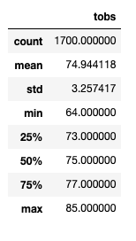
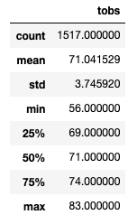

# Temperature
### Purpose: Use SQLite to help W. Avy to add more information about temperature trends before opening the surf shop. The information will include temperature data for the months of June and December in Oahu.

### Result:
June Temperature:

December Temperature:

### Summary:
Based on the result, W. Avy could have the business year around. The different temperature between high and low temperature in June and December is 27 degree and the different temperature between the high and low temperature in December is 21 degree. The average temperature in June and December is not much different. Therefore, there is not a big deal to sell ice cream in June or December. Because the weather in Hawaii is good for selling ice cream in year-round.
There are two additional queries that should be considerred is the amount of the precipitation in June and December and the wind spped in June and December. The high volume of of rain the strong wind speed could effect a lot to the profit of selling ice cream in Hawaii. In all, W. Avy should countinue investing the ice cream shop in Haiwaii sinceHaiwaii have a very good weather condition for selling ice cream.

